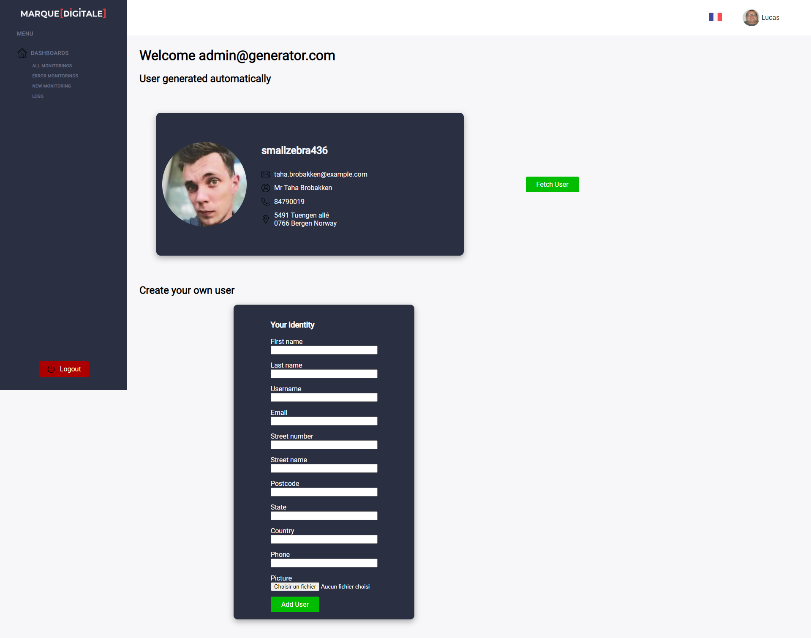

# Generator User 10-10-2022
> A user generator for a livelier "pre-prod experience" 
> Live demo [_here_](https://final--quiet-toffee-6998a5.netlify.app). 

## Table of Contents
* [General Info](#general-information)
* [Language Used](#language-used)
* [Dashboard view](#dashboard-view)
* [Setup](#setup)
* [Usage](#usage)
* [Project Status](#project-status)
* [Room for Improvement](#room-for-improvement)
* [Acknowledgements](#acknowledgements)
* [Contact](#contact)

## General Information
- First the mission was to use an api, and to make a call. Then starting in the same principle generate by hand, with a form through props, a component a bit in the style of the API.
- Reinvent preprod users such as "test@test.fr" or the famous "aze@aze.fr" with an interface.  A random or manual user generation via a button and a form for the manual part

## Language Used
- Javascript with React
- SCSS

## Dashboard view

## Setup
The project needs the React library to run. Some dependencies are needed to make it work:
- [React router dom](https://www.npmjs.com/package/react-router-dom) for navigation and setting up urls
- [Sass] (https://www.npmjs.com/package/sass) to code in scss instead of css

To install these dependencies you just have to launch the following command:

`npm i`

To launch the project locally, simply run the command: 

`npm start`

## Usage
To start, you only need to login with an email address that respects the email standard and a password of 8 characters or more.  
Example :  
- admin@generator.com 
- 12345678

Once on the dashboard you can generate a random user by pressing the "fetch user" button or create your own user using the form below.   
Example :  

## Project Status
The project is still in progress.  
It lacks scss style, and it should be possible to upload an image and have it displayed when filling the form.

## Room for Improvement
The UI needs to be redesigned and a more suitable version is in the works. 

Opportunity for improvement :
- Make a real identity card
- Add and display an image in the user creation form

To do:
- Be able to copy information with one click on a linked button.

## Acknowledgements
- Many thanks to my trainer [his Github](https://github.com/bendahmanem)

## Contact
Created by [@RonflexAzOg](https://github.com/RonflexAzOg)